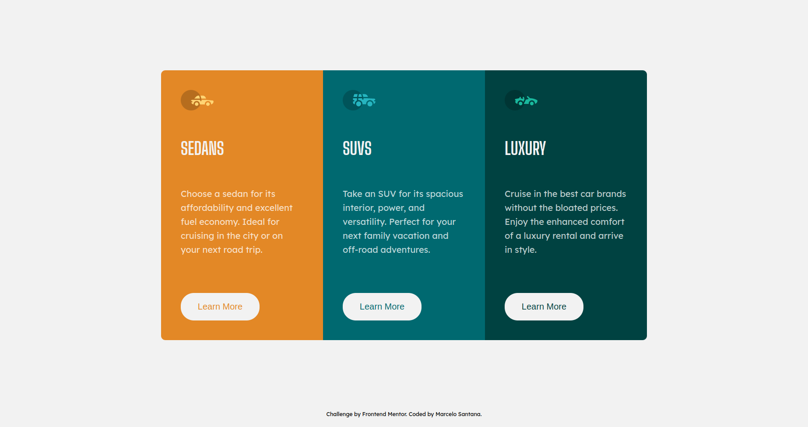

# Frontend Mentor - 3-column preview card component solution

This is a solution to the [3-column preview card component challenge on Frontend Mentor](https://www.frontendmentor.io/challenges/3column-preview-card-component-pH92eAR2-). Frontend Mentor challenges help you improve your coding skills by building realistic projects. 

## Table of contents

- [Overview](#overview)
  - [The challenge](#the-challenge)
  - [Screenshot](#screenshot)
- [My process](#my-process)
  - [Built with](#built-with)
  - [What I learned](#what-i-learned)
  - [Continued development](#continued-development)
  - [Useful resources](#useful-resources)
- [Author](#author)

**Note: Delete this note and update the table of contents based on what sections you keep.**

## Overview

### The challenge

Users should be able to:

- View the optimal layout depending on their device's screen size
- See hover states for interactive elements

### Screenshot

## My process

### Built with

- Semantic HTML5 markup
- CSS custom properties
- Flexbox
- Mobile-first workflow

### What I learned

I learned and practiced about HTML and mostly about CSS Flexbox. Also, the use of variables on CSS is really helpful during the process of styling a page.

### Continued development

I want to keep my focus on web development and explore/train more about CSS.

### Useful resources

- [CSS-Flexbox](https://origamid.com/projetos/flexbox-guia-completo/) - This helped me for CSS Flexbox. I really liked this pattern and will use it going forward.
- [Visual Guide to CSS3 Flexbox](https://coding.imweb.io/demo/flex/index.html) - This is an amazing site which helped me seeing the properties of CSS flexbox and how it would look like. 

## Author

- Website - [Marcelo Santana](https://www.github.com/marcsantana)
- Frontend Mentor - [@marcsantana](https://www.frontendmentor.io/profile/marcsantana)
- Linkedin - [@marc-santana](https://www.linkedin.com/in/marcelo-santana)
